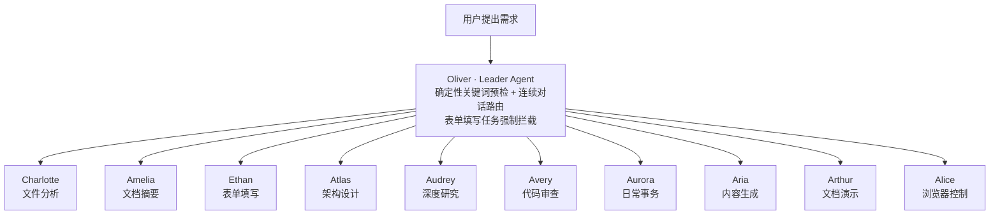

<div align="center">

# Ability

**基于多 Agent 协作的智能体系统，集成 11 个专业 Agent。**

支持智能表单填写、文件夹分析、代码审查、架构设计、深度研究、文档与演示生成、跨会话记忆、定时任务、多模型切换及网页自动化等能力。

[](./LICENSE)
[](./CHANGELOG.md)
[](#agent-模式)
[](#技术栈)

</div>

> 💡 **看不懂怎么用？** 别啃文档——**把这个仓库扔给 AI 助手**，说一句「按这份 README 和 DEPLOYMENT.md，帮我在本机把这个多Agent智能体系统跑起来」，让它读完替你做就行。

---

## 目录

- [Agent 模式](#agent-模式)
- [功能特性](#功能特性)
- [定时任务](#定时任务)
- [设置](#设置)
- [快速开始](#快速开始)
- [技术栈](#技术栈)
- [项目结构](#项目结构)
- [版本历史](#版本历史)
- [常见问题 FAQ](#常见问题-faq)
- [License](#license)

---

## Agent 模式

Agent 是应用的核心模式，默认打开即进入 Agent 模式。用户向 Agent 提出需求，Agent 自动规划、执行并返回结果。



| 角色              | 职责                              |
| --------------- | ------------------------------- |
| Oliver（调度）      | 理解你的问题，自动分配给最合适的 Agent 处理       |
| Charlotte（文件分析） | 分析文件夹结构、文件类型分布                  |
| Amelia（文档摘要）    | 读取文档内容，快速了解项目                   |
| Ethan（表单填写）     | 分析文档中的信息采集项，对话式帮你填写文档           |
| Atlas（架构设计）     | 用 mermaid 生成架构图、模块依赖图、数据流图      |
| Audrey（深度研究）    | 多来源调研、竞品分析、结构化报告生成              |
| Avery（代码审查）     | 自动运行测试、分析失败、代码审查                |
| Aurora（日常事务）    | 新闻摘要、定时提醒、文件分类整理、桌面通知           |
| Aria（内容生成）      | 文章、文案、邮件、社交媒体内容生成               |
| Arthur（文档演示）    | Word/PPT/Excel/PDF/HTML 多格式文档处理 |
| Alice（浏览器控制）    | AI 驱动的网页自动化、表单填写、数据抓取           |

## 功能特性

- **智能表单填写**（Ethan）：从文档中提取待填项，对话式收集信息并自动填入文档

- **多 Agent 协作**：11 个 Agent 并行协作，Leader Agent 自动路由与交叉评审

- **文件夹分析**（Charlotte）：扫描项目结构、文件类型分布，给出改进建议

- **代码审查与测试**（Avery）：自动运行测试、分析失败原因、提供代码审查建议

- **文档摘要**（Amelia）：提取文档核心内容，快速了解项目

- **架构设计**（Atlas）：mermaid 架构图、模块依赖图、数据流图

- **深度研究**（Audrey）：多来源调研、竞品分析、结构化报告生成

- **内容生成**（Aria）：文章、文案、邮件、社交媒体内容生成

- **文档与演示**（Arthur）：Word/PPT/Excel/PDF/HTML 多格式文档处理

- **跨会话记忆**：L0-L3 四层记忆系统（L0 长期偏好/规则 → L1 项目上下文 → L2 会话历史 → L3 临时缓存），含自动过期机制

- **定时任务**：cron 5 字段解析引擎，支持定时触发 Agent 任务

- **多模型支持**：内置 DeepSeek、OpenAI、Anthropic、Google、智谱、通义千问、Moonshot、小米 MiMo 等 Provider，兼容任意 OpenAI 兼容 API

- **能力组件库**：代码编辑器、Diff 对比器、评估备忘录、文件管理、HTML 幻灯片、HTML 报告、编辑级图表、定时任务、插件管理

- **文档处理**：Word/PPT/Excel/PDF 生成，PDF 智能分析，代码审查 CLI 桥接

- **Smart Form 填写**：Word/Excel/PDF 表单字段自动提取与对话式填写，支持书签/窗体控件优先策略

- **办公抽屉文档保真**：办公抽屉内置文档可视化编辑器，排版、字体、页眉页脚、表格逐项还原 WPS / Word；编辑后导出除改动处外保持原样（格式保留式导出）

- **侧边栏优化**：文件夹、Agent、历史三区块独立折叠，滚动条无缝集成，UI 细节全面优化

## 定时任务

在「定时任务」页面可以创建周期性自动执行的任务，基于 cron 表达式调度，支持 5 字段语法：

```
分钟 小时 日 月 星期几
```

常用示例：

| 表达式           | 含义            |
| ------------- | ------------- |
| `0 9 * * 1-5` | 工作日每天早上 9 点   |
| `0 8 * * 1`   | 每周一早上 8 点     |
| `0 10 1 * *`  | 每月 1 号上午 10 点 |

创建任务时需指定一个 Agent 模式和一个任务描述，到达调度时间后对应 Agent 会自动执行。

## 设置

在「设置」页面可以配置以下内容：

- **API Key 管理**：支持 DeepSeek、OpenAI、Anthropic、Google、智谱、通义千问、Moonshot、小米 MiMo 等模型，Key 加密存储在本地

## 快速开始

> 📦 如果想要从零开始在本机部署，请阅读详细的 **部署说明**：[DEPLOYMENT.md](./DEPLOYMENT.md)

### 环境要求

- Node.js >= 18

- npm >= 9

### 安装依赖

```bash
npm install
```

### 开发模式

```bash
npm run dev          # 启动 Vite 开发服务器
npm run neu:dev      # 启动 Neutralinojs 桌面应用（带调试器）
```

### 构建桌面应用

```bash
npm run build        # 构建生产版本（Vite）
npm run preview      # 本地预览生产构建
npm run neu:build    # 构建并打包 Neutralinojs 桌面应用
```

### 配置 API Key

启动应用后，点击底部状态栏的 **配置 API Key**，进入「设置」页面，输入各厂商 API Key 即可使用对应模型。Key 加密存储在本地。

## 技术栈

- **前端**：React 18 + TypeScript + Tailwind CSS

- **桌面框架**：Neutralinojs

- **状态管理**：Zustand

- **构建工具**：Vite 5

- **办公套件**：Univer（@univerjs/presets，内置工作表 / 文档可视化编辑）+ RxJS

- **文档处理**：PizZip（docx / xlsx 解析）、pdf-parse（PDF 读取）、docx / pptxgenjs / xlsx / pdf-lib（文档生成）、react-markdown + remark-gfm（Markdown 渲染）

## 项目结构

```
ai-agent-app/
├── src/
│   └── renderer/           # 前端界面（Vite 构建根目录）
│       ├── agents/         # Agent 定义与注册（Oliver / Charlotte / Amelia 等 11 个）
│       ├── api/            # Neutralinojs Native API 封装
│       ├── codebase/       # 代码库依赖分析
│       ├── components/     # UI 组件库
│       ├── knowledge/      # 知识库检索
│       ├── memory/         # 记忆存储（L0-L3 四层）
│       ├── services/       # 服务层（LLM / 文档 / 调度 / OCR）
│       ├── skills/         # Skill 定义（diagram-design / code-review / routing）
│       ├── stores/         # Zustand 状态管理
│       ├── styles/         # 全局样式
│       ├── ui-backup/      # UI 组件备份
│       ├── utils/          # 工具函数
│       ├── App.tsx         # 应用入口
│       ├── index.html      # Neutralino 启动页
│       └── main.tsx        # React 挂载入口
├── neutralino.config.json  # Neutralino 桌面应用配置
├── vite.config.ts          # Vite 构建配置
├── tailwind.config.js      # Tailwind CSS 配置
└── package.json
```

## 版本历史

**当前版本：v3.0.5-Beta**（2026-09-03）

从 1.0.0（初始版本）到 v3.0.5-Beta 的完整更新记录已移至 **[CHANGELOG.md](./CHANGELOG.md)**。

## 常见问题 FAQ

**Q：支持哪些 AI 模型？**
A：内置 DeepSeek、OpenAI、Anthropic、Google、智谱、通义千问、Moonshot、小米 MiMo 等 Provider，并兼容任意 OpenAI 兼容 API。

**Q：API Key 存在哪里，安全吗？**
A：Key 加密存储在本地。

**Q：怎么从零开始在本机部署？**
A：阅读 [DEPLOYMENT.md](./DEPLOYMENT.md)；本机已有环境时按「快速开始」执行即可。

**Q：智能表单填写支持哪些文档格式？**
A：Word（`.docx`）、Excel（`.xlsx` / `.xls`）、PDF、常见文本与标记语言等 14 种格式。

**Q：定时任务怎么写？**
A：cron 5 字段语法（分钟 小时 日 月 星期几），例如 `0 9 * * 1-5` 表示工作日每天早上 9 点。

**Q：可以商用吗？**
A：不可以。本项目采用 **CC BY-NC 4.0**（署名-非商业性使用）授权，禁止商业使用，详见 [LICENSE](./LICENSE)。

## License

本软件采用 **知识共享署名-非商业性使用 4.0 国际许可协议（CC BY-NC 4.0）** 授权：可免费用于**个人、学习与非商业**用途（需署名，允许二次创作/共享），**禁止商业使用**；商业用途需另行联系授权。详见 [LICENSE](./LICENSE)。
